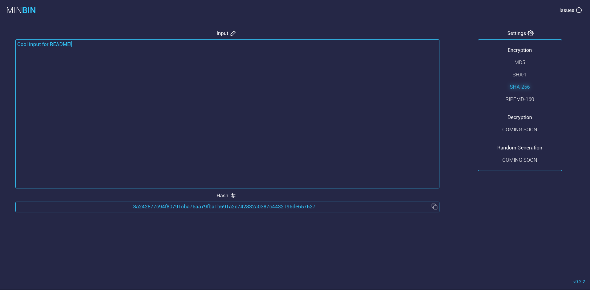

# 


[](https://travis-ci.org/ydlamba/minbin)


A minimal set of somes handly tools like hash calculator, password generation.
### Sneak Peak

<p align="center">Check it out: <a href="https://ydlamba.github.io/minbin" target="_blank">https://ydlamba.github.io/minbin</a>
</p>

### Features
- Tools
  - Encryption
    - MD5
    - SHA-1
    - SHA-256
    - RIPEMD-160
  - Decryption
    - Coming Soon *(Under active development)*
  - Random Generation
    - Coming Soon *(Under active development)*
- Update output automatically
- Copy to clipboard option
- Neat and Clean UI

*If anyone wants to add any feature/tool just submit a Pull Request, most welcome!*
### Development
To run a locally, you will need to install yarn, then run the following commands:
```
$ yarn
```
To start a dev server run:
```
$ yarn start
```
To build:
```
$ yarn build
```
### Deployment (at gh-pages)

Auto deployment using [Travis CI](https://travis-ci.org)

For deploy using command line:
```
$ yarn deploy
```
### Built With
[TypeScript](https://github.com/Microsoft/TypeScript) + [react](https://github.com/facebook/react) + [redux](https://github.com/reduxjs/redux) + [webpack](https://github.com/webpack/webpack) + :heart:


